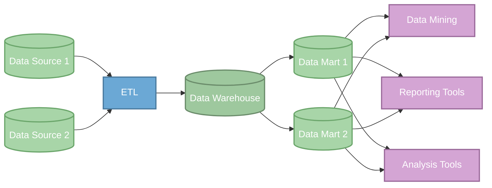
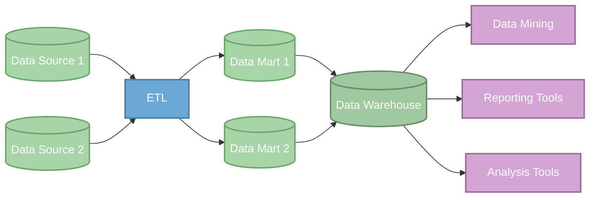

# Data Warehousing Concepts

## DATA WAREHOUSE BASICS

### What is a DWH?

> A computer system designed to store and analyze large amounts of data for an organization.

Data warehouses:

- Use data from different areas of an org
- Integrate and store the data
- Make it available for analysis

### Why are they valuable?

They help orgs:

- Support business intelligence (BI) activity
- Enable effective org analysis and decision-making
- Find ways to innovate based on insights from their data

Some common scenarios:

- Product sales forecasting
- Governance and regulation adherence
- Insight and growth

### Data Warehouse vs Data Mart vs Data Lake

#### Data warehouse

- Gathers and integrates data to make it available for analysis
- Has many input data sources
- Stores structured data
- Complex to change: Upstream/Downstream effects must be considered
- Typically >100 GB in size
- Also used to avoid slowing down transactional/operational database
  when complex queries are run.

#### Data mart

- relational db for analysis
- data is focused in one subject area/department (like finance)
- fewer input data sources
- typically <100 GB

#### Data lake

- main purpose is to store data that may or may not be used
- stores unstructured and structured data
  - less organized
  - use a data catalog or it becomes a "data swamp"
- contains data from the entire organization
  - data from many departments
- many input data sources
- typically >100 GB in size
- less complex to make changes (fewer upstream/downstream effects to consider)

### Data Warehouse Life Cycle

#### 1. Planning

- requirements gathering
- data modeling

#### 2. Implementation

- etl design & development
  - implement data piplines and ETL process
- BI application development
  - setup bi tools

#### 3. Support/Maintenance

- maintenance
  - make any needed changes
- test & deploy

#### Persona matrix (who's needed during each phase)

| Life cycle step            | Analysts | Data Scientist | Data Engineers | Database Administrators |
| :------------------------- | :------: | :------------: | :------------: | :---------------------: |
| Business Requirements      |    X     |       X        |                |                         |
| Data Modeling              |    X     |       X        |       X        |            X            |
| ETL Design & Development   |          |                |       X        |            X            |
| BI Application Development |    X     |       X        |                |                         |
| Maintenance                |          |                |       X        |                         |
| Test & Deploy              |    X     |       X        |       X        |                         |

---

## WAREHOUSE ARCHITECTURES AND PROPERTIES

### Layers of a Data Warehouse

#### data source

- all data sources for DWH
  - transactional database
  - log files
  - spreadsheets

#### data staging

- extraction, transformation, and cleaning of data through ETL process
- contains ETL process and storage tables
  - data is extracted
  - business rules are applied and data is cleaned
  - uses staging tables to temporarily hold data during transformations
  - must be able to extract valid data (ie. data that can be stored in the next phase)
  - batch/full loading

#### data storage

- data from staging results is stored in data warehouse and data marts
  - different approaches:
    - dwh -> data mart
    - data mart -> dwh

#### data presentation

- users interact with stored data using:
  - BI tools
  - data mining tools
  - direct queries

### Data Warehouse Architectures

#### Inmon: top-down

- figure out all data definitions, cleaning, and business rules _BEFORE_ any data enters the warehouse
- data is stored in a normalized for (reduced data redundancy + improved data quality)

Pros:

- Single source of truth
- less storage due to normalization
- easy to change data marts to support reporting changes

Cons:

- normalization leads to more joins which leads to slower response time
- more upfront work, higher startup cost
  - More work because you have to figure out all the data definitions
  - can speed up development if it is a well-established industry like banking,
    or if org already has a set of integrated data with definitions

#### Kimball: bottom-up

- Data is denormalized into star schema
- priority is getting from data to reporting as fast as possible
- focuses on departmental data mart
  - organize and define the data definitions of one department first
  - then place it into the data mart and make it available for reporting
  - then move on to the next department and continue the cycle

Pros:

- upfront development speed
  - lower startup cost
- denormalized data requires less joins, its more user friendly

Cons:

- denormalization increases ETL processing time
- greater possibility of duplicate data, making changes harder
- ongoing development needed

### OLAP and OLTP

#### OLAP: OnLine Analytical Processing

- Designed to support analysis of large amounts of data
- queries can be complex and read-only for analysis
- example dimensions:
  - country, state, city
  - years, months, days
- reorganizes data into multidimensional format

##### OLAP data cube

- faster processing vs traditional relational databases
- example:
  - 3 dimensions: region, year, and product
  - able to get org's sales by region, year and product
  - "cubes" with more than 3 dimensions are called "hypercubes"

#### OLTP: OnLine Transaction Processing

- Designed to process a large volume of simple database transactions and queries quickly
  - ex: ATMs and reservation bookings
- queries tend to affect only a few rows of data within the db
- critical for business and not used for analysis
- can be used as a source system feeding into the data warehouse

---

## DATA WAREHOUSE DATA MODELING

### Data Modeling

- bottom-up/kimball model: star & snowflake schemas

Fact tables:

- measurements, metrics, or facts about an org process
  - ex: `Sales_Order_fact[CustomerID FK, DateID FK, ProductID FK, UnitSold, SalesAmount, Tax]`
  - each row captures a measurement/metric about one process transaction
  - needs to be joined with dimension tables

Dimension tables:

- attributes/characteristics ("dimensions") about a process
  - describe the data in the fact table
  - ex: `Customer_Dim[CustomerID (pk), Name, AccountNum, LoyaltyID, Country, Email]`
  - "reference table", joined with a fact table allows one to perform analysis

#### Star schema

- Central fact table, with one or more dimensional tables (1-level)
- fewer joins = easier to query
- faster queries
- denormalized -> higher storage usage

#### Snowflake schema

- At least one dimensional table does not directly join a fact table (multi-level)
  and must be joined through another dimensional table.
- more joins = harder to query
- slower queries
- highly normalized -> lower storage user and higher data integrity
- ex: adding a `Country_Dim[CountryID PK, Pop, AvgGDP, Lang]` table related to the `Customer_Dim[..., Country FK]`
  turns the star schema into a snowflake schema
  - this is because `Country_Dim` can't be joined to the fact table directly, but must be joined through `Customer_Dim`

### Kimball's four step process to create a data warehouse

#### Step 1 - Select the organizational process

- Ask questions about a process
  - business process like:
    - invoice/billing
    - product quality monitoring
    - marketing

#### Step 2 - Declare the grain

- Grain = level of data stored in the fact table
- Choose lowest level possible (not required, but advised)
  - A level of data that cannot be split further
  - Ex: Music service -> Song grain
    - "Which song is the most popular?"
  - Ex: Shipping service -> Line item grain
    - "Which products were delayed the most in shipping?"
  - Org users may be unable to answer questions they have if you choose the wrong grain

#### Step 3 - Identify the dimensions

- Choose dimensions that apply to each row
  - Common dimensions:
    - **Time:** year, quarter, month
    - **Location:** address, state, country
    - **Users:** names and email address
- Seek to answer "How do org users describe the data that results from the business process?"
- Get feedback from users and analysts that work with the data

#### Step 4 - Identify the facts

- Numerical facts for each fact table row
- what are we answering?
- metrics should be true at selected grain
- fact examples:
  - music service: total num of plays, sales revenue of a song
  - ride-sharing: travel distance, time needed

### Slowly Changing Dimensions (SCDs)

#### Traditional Approach (Kimball Approach)

##### Type 1

- Update the value in table
- Lose history: All previous values are not tracked, when you change it you don't know the prev. values
- Historical reports will be using the new value instead of the previous ones

###### Example

**Original**

| ProductID | Description  | Category      |
| :-------- | :----------- | :------------ |
| 12345     | Tesla-ModelY | electric-veh. |

**New**

| ProductID | Description  | Category           |
| :-------- | :----------- | :----------------- |
| 12345     | Tesla-ModelY | electric-crossover |

##### Type 2

- Add a new row to the table with the updated value
- Add date columns to keep track of when those values where put in effect

###### Example

**Original**

| ProductID | Description  | Category      |
| :-------- | :----------- | :------------ |
| 12345     | Tesla-ModelY | electric-veh. |

**New**

| ProductID | Description  | Category           | StartDate  | EndDate    |
| :-------- | :----------- | :----------------- | :--------- | :--------- |
| 12345     | Tesla-ModelY | electric-veh.      | 1970-01-01 | 2022-03-10 |
| 20053     | Tesla-ModelY | electric-crossover | 2022-03-11 | 2050-12-31 |

##### Type 3

- Add a new column to the dim. table to track changes (holds the prev val)
  - You can also add a col to track the date the change took place.
- Use the historical column when running historical reports
- Can require updating historical report queries and is limited to tracking
  only one historical change (eg. current val and old val)
  - You _could_ add more column to keep track of more historical changes

###### Example

**Original**

| ProductID | Description  | Category      |
| :-------- | :----------- | :------------ |
| 12345     | Tesla-ModelY | electric-veh. |

**New**

| ProductID | Description  | Category           | PastCategory |
| :-------- | :----------- | :----------------- | :----------- |
| 12345     | Tesla-ModelY | electric-crossover | electric-veh. |

#### Modern Approach

- Snapshot the whole dimension table
  - Feasible since dim tables have fewer rows that fact tables, and
    modern hardware can easily handle storing duplicate copies of tables.
  - Update value like in type 1 scd
- Use historical snapshots for historical reports

### Row vs Column Data Store

Row:

- row data is stored together in "blocks"
- ideal for transactional records

Column:

- col data is stored together in blocks
- ideal for analytical workloads
- better data compression

Column store allows the system to read in blocks that contain only the data needed for the query, versus row store, where the blocks may include data from columns not required for the query. This results in more blocks needing to be read and a longer query time.

---

## IMPLEMENTATION AND DATA PREP

### ETL and ELT

#### ETL

- Data is transformed during the move
- Uses separate system to process data
- Clean/transformed data arrives into the dwh
- Process:
  1. Extract
  2. Transform
  3. Load

Pros:

- lower data storage costs
  - because only the transformed data is kept
- PII security compliance
  - because it can be ommitted so it never makes it into the DWH

Cons:

- Transformation errors/changes require new data pulls
  - since the original data is not kept, just the transformed data
- Costs of separate system to process data

#### ELT

- Extracts and loads the original data into the destination, then it is transformed
- Uses the warehouse to transform the data instead of a separate system
- Process:
  1. Extract
  2. Load
  3. Transform

Pros:

- No separate system to process data
- Transformations can be rerun without impacting source systems
- Works well for near real-time requirements

Cons:

- Increased storage usage due to storing raw data
- Additional considerations needed to comply with PII security standards

### Data Cleaning

Having strong data governance reduces the amount of cleaning processes.
Data governance develops rules and definitions for the data, detecting and correcting data that deviates from its definition.
Therefore, by the time it gets to ETL/ELT less data cleaning needs to be done.

#### Data format revision

- Update values to a standard format
  - dates
  - names of options
  - capitalization
- Ensures consistent output format

#### Address parsing

- Divides address into components (street, city, state, country, etc.)
- can use tools to validate address

#### Data validation

- Range check
  - Is the value within expected range? (eg. person's age)
- Type check
  - Is the value the proper data type? (eg. storing age as string vs number)

#### De-duplication

- Remove duplicate rows of data

### On premise and cloud data warehouses

#### On premise

- purchase and install software/hardware on-site
- Pros:
  - complete control
  - implement strict and custom data governance
  - local network speeds
  - can optimize for workloads
- Cons:
  - upfront hardware/software costs
  - staff must maintain system
  - must keep up with patches and security

#### Cloud

- rapid growth
- Pros:
  - no infra/equipment maintenance
  - frees up personnel
  - scalable
  - no upfront investment in hardware/software
- Cons:
  - less control
  - cannot optimize warehouse workloads
  - possible unanticipated costs

#### Hybrid

- on-premise and in the cloud
- reasons:
  - backup
  - disaster recovery

 ### Data warehouse design example

scenario:

- new startup company
- photo sharing app

#### top-down or bottom-up?

considerations:

- vital to show business impact quickly
- top-down approach takes too long upfront

decision:

- bottom-up (delivers data to user quickly)
- sales data mart must be the priority

#### Kimball (since we chose bottom-up approach)

1. data modeling: select org process
   - considerations:
     - what type of customers purchase large volumes of photos?
   - deicision:
     - develope customer purchases
2. declare data grain
   - considerations:
     - data should be flexible to answer many questions
     - selecting the lowest grain possible
   - decision:
     - tracking customer/photo purchases
3. identify dimensions
   - considerations:
     - how do users describe the data that results from the business process?
     - customer prioritization
   - decision:
     - customer location (country & state)
     - date customer joined
     - default payment method
4. identify the facts
   - considerations:
     - what are we answering?
   - decision:
     - time spent viewing photo before purchase
     - photo cost and tax
     - date of purchase

#### On-premise or cloud implementation?

Considerations:

- do not want upfront costs for hardware/software infra
- small team - focus on high value activities

Decision:

- cloud

#### ETL or ELT implementation?

Considerations:

- keep all data
- cloud implementation allows us to scale compute as needed

Decision:

- ELT

---

## BONUS RESOURCES

- The Data Warehouse Toolkit: The definitive guide to dimensional modeling (by Kimball)
- Building the Data Warehouse (by Inmon)
- DAMA - Data Management Body of Knowledge (by DAMA International)
