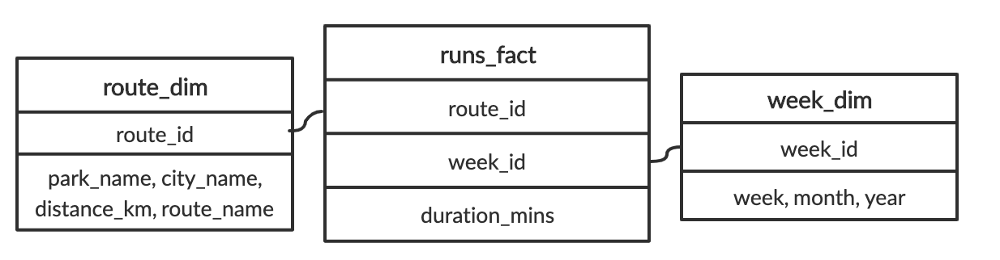
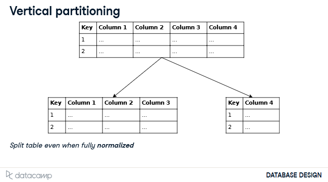

# Database Design

## Data modeling

1. Conceptual data model: describes entities, relationships, and attributes
   - Tools: data structure diagrams (ERD, UML, etc.)
2. Logical data model: defines tables, columns, relationships
   - Tools: database models and schemas (relational model and star schema)
3. Physical data model: describes physical storage
   - Tools: partitions, CPUs, indexes, backup systems and tablespaces
  
### Dimensional modeling


#### Fact tables

- decided by business use-case
- holds records of a metric
- changes regularly
- connects to dimensions via foreign keys

#### Dimension tables

- holds descriptions of attributes
- does not change as often

#### Query example



**Total duration of all runs**

```sql
SELECT 
	-- Select the sum of the duration of all runs
	SUM(duration_mins)
FROM 
	runs_fact;
```

**Total duration of all runs _in July_**

```sql
SELECT 
	-- Get the total duration of all runs
	SUM(duration_mins)
FROM 
	runs_fact
-- Get all the week_id's that are from July, 2019
INNER JOIN week_dim
USING(week_id)
WHERE month = 'July' and year = '2019';
```

### Star schema vs Snowflake schema

Star schema
- One dimension out (fact table with dim tables)
- Best for OLAP (data warehouses)
  - Read-intensive
  - Prioritizing quicker queries for analytics

Snowflake schema
- Multiple dimensions out (fact table with dim tables, but the dim tables also have dim tables)
- Best for OLTP (operational database)
  - Write-intensive
  - Prioritizing quicker and safer insertion of data
- Pros:
  - No data redundancy due to the amount of dim tables
  - Great for reducing space since information is stored once in its respective dim table
  - Safer updating, removing and inserting (less places to change)
  - Easier to redesign by extending
- Cons:
  - Longer and more complex queries requiring more CPU power
 
#### Why do we care about normalizing?

When we don't normalize eneough we risk 3 of anomalies:

- Update anomaly: When data inconsistency is caused by data redundancy when updating
  - If not normalized enough you will have to update more than one record or risk inconsistency
  - When updating you need to know all places where the duplicate data is
- Insertion anomaly: Unable to add a record due to missing attributes
  - If not normalized enough, you may not be able to insert a record unless all attributes are accounted for unless one or more columns accept nulls
- Deletion anomaly: When deleting a record unintentionally deletes other data
  - 
## Views

A view is like a whole query but with an alias, which can be queried as a normal table.

Benefits:

- Don't take up storage
- Form of access control (only show the user what you want by not including certain column in the view)
- Masks the complexity of queries (**USEFUL for highly normalized schemas**)

To view all views (excluding system views) use the following query:

```sql
SELECT * FROM information_schema.views
WHERE table_schema NOT IN ('pg_catalog', 'information_schema');
```

Create a view with:

```sql
CREATE VIEW view_name AS
SELECT ... FROM ...
WHERE ...;
```

### Granting and revoking access

```sql
[GRANT | REVOKE] [SELECT | INSERT | UPDATE | DELETE]
ON [table | view | schema ]
[TO | FROM] <role>
```

Examples:
```sql
GRANT UDPATE ON ratings TO PUBLIC;

REVOKE INSERT ON films FROM db_user;
```

### Updating views

When you update a view you are updating the table that the view uses.
To update the view it must fulfill these requirements:

- View is made up of one table only
- Doesn't use a window or aggregate function

Example:

```sql
UPDATE films SET kind = 'Dramatic' WHERE kind = 'Drama';
```

### Inserting into a view

_Avoid modifying data through views_

View requirements:

- View is made up of one table only
- Doesn't use a window or aggregate function

Example:

```sql
INSERT INTO films (code, title, did, date_prod, kind)
    VALUES ('T_601', 'Yojimo', 106, '1961-06-16', 'Drama')
```

### Dropping a view

```sql
DROP VIEW view_name [ CASCADE | RESTRICT ]
```

- `RESTRICT` returns an error if there are objets that depend on the view
- `CASCADE` drops view and any obj that depends on that view

### Redefining a view

When using `CREATE OR REPLACE the following must be met:

- If the view exists it will be replaced
- The new query must generate the same column names, order, and data types as the old query
- The column output may be different
- New columns may be added at the end

**If these requirements can't be met, drop the view and create a new one**

```sql
CREATE OR REPLACE VIEW view_name AS
<new query>
```

### Altering view attributes

```sql
ALTER VIEW [ IF EXISTS ] name ALTER [ COLUMN ] column_name SET DEFAULT expression
ALTER VIEW [ IF EXISTS ] name ALTER [ COLUMN ] column_name DROP DEFAULT
ALTER VIEW [ IF EXISTS ] name OWNER TO { new_owner | CURRENT_ROLE | CURRENT_USER | SESSION_USER }
ALTER VIEW [ IF EXISTS ] name RENAME [ COLUMN ] column_name TO new_column_name
ALTER VIEW [ IF EXISTS ] name RENAME TO new_name
ALTER VIEW [ IF EXISTS ] name SET SCHEMA new_schema
ALTER VIEW [ IF EXISTS ] name SET ( view_option_name [= view_option_value] [, ... ] )
ALTER VIEW [ IF EXISTS ] name RESET ( view_option_name [, ... ] )
```

### Materialized views

Materialized views store the results on disk and are good to use when:

- The query takes a long time to run
- Underlying query results don't change often (otherwise you are performing analysis on oudated-data)
- Data warehousing since OLAP is not write-intensive
  - It also save on computational costs since the results are saved and not re-computed like a regular view

Materialized views are often made up of other materialized views, which introduces the challenge of managing when to refresh materialized views due to the dependencies. You must take into account query run time and dependency chains.
 
#### Implementing materialized views

```sql
CREATE MATERIALIZED VIEW view_name AS
...;

REFRESH MATERIALIZED VIEW ...;
```
## Roles and Access Control

```sql
CREATE ROLE role_name;

-- with password
CREATE ROLE role_name WITH PASSWORD 'password' VALID UNTIL 'yyyy-mm-dd';

-- admin role
CREATE ROLE admin_role_name CREATEDB;

-- altering roles (eg. give permission to create roles)
ALTER ROLE role_name CREATEROLE;

-- Grating / Revoking privileges from roles
GRANT [SELECT | INSERT | UPDATE | DELETE | ...] ON obj_name TO role;
REVOKE [SELECT | INSERT | UPDATE | DELETE | ...] ON obj_name FROM role;

-- Group roles
CREATE ROLE group_role_name;  -- Essentially just a regular role but used by other roles
CREATE ROLE user_role_name ...;

GRANT group_role_name TO user_role_name;
REVOKE group_role_name FROM user_role_name;

-- Altering roles
ALTER ROLE role_name ...;
--- Example:
ALTER ROLE marta WITH PASSWORD 's3cur3p@ssw0rd';
```
## Partitions

### Vertical Partitioning

Useful when a set of columns is used more frequently over other columns in the same table. Also allowing one to put less frequently accessed data in a slower medium.

The table is split (yes even when fully normalized), the frequently columns are placed in their own table, and the other columns in another table, then you use a shared key to link them.



#### Example

```sql
-- Create a new table called film_descriptions
CREATE TABLE film_descriptions (
    film_id INT,
    long_description TEXT
);

-- Copy the descriptions from the film table
INSERT INTO film_descriptions
SELECT film_id, long_description FROM film;
    
-- Drop the descriptions from the original table
ALTER TABLE film DROP COLUMN long_description;

-- Join to view the original table
SELECT * FROM film 
JOIN film_descriptions USING(film_id);
```

### Horizontal Partitioning

Can easily "upgrade" (extend) partitioning to sharding, making use of parallelization.

Pros:
- Indices of heavily-used partitions fit in memory
- Move to specific medium: slower vs. faster
- Used for both OLAP and OLTP

Cons:
- Partitioning existing table can be a hassle
- Some constraints can not be set

#### Example

Range partition:

```sql
CREATE TABLE sales (
    ...
    timestamp DATE NOT NULL
)
PARTITION BY RANGE(timestamp);

CREATE TABLE sales_2019_q1 PARTITION OF sales
    FOR VALUES FROM ('2019-01-01') TO ('2019-03-31');
...
CREATE TABLE sales_2019_q4 PARTITION OF sales
    FOR VALUES FROM ('2019-10-01') TO ('2020-01-31');
CREATE INDEX ON sales ('timestamp');
```

List partition

```sql
-- Create a new table called film_partitioned
CREATE TABLE film_partitioned (
  film_id INT,
  title TEXT NOT NULL,
  release_year TEXT
)
PARTITION BY LIST (release_year);

-- Create the partitions for 2019, 2018, and 2017
CREATE TABLE film_2019
	PARTITION OF film_partitioned FOR VALUES IN ('2019');

CREATE TABLE film_2018
	PARTITION OF film_partitioned FOR VALUES IN ('2018');

CREATE TABLE film_2017
	PARTITION OF film_partitioned FOR VALUES IN ('2017');

-- Insert the data into film_partitioned
INSERT INTO film_partitioned
SELECT film_id, title, release_year FROM film;

-- View film_partitioned
SELECT * FROM film_partitioned;
```
## DBMS types

### SQL

- relational
- best when:
  - data is structured and unchanging
  - data must be consistent

### NoSQL

- less structured
- document-centered rather than table-centered
- doesn't have to fit into well-defined rows and columns
- best when:
  - rapid growth
  - no clear schema definitions
  - large quantities of data
  - need  more flexibility

#### NoSQL types

- key-value store
  - value can be anything
  - good for session information
  - ex: redis
- document store
  - value is more structured
  - good for content management systems
  - ex: mongoDB
- columnar database
  - stores data in columns
  - scalable
  - good for big data analytics
  - ex: BigQuery, Cassandra
- graph database
  - interconnected data best represented as a graph
  - good for social media data, recommendations based on behavior
    - ex: neo4j

