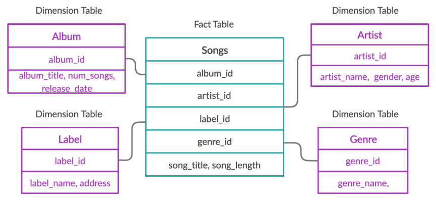

# Joining Data with SQL

## Joins

- Use `USING(col_name)` when joining tables on the same named column, else `table1.col1 = table2.col2`
- `INNER JOIN` and `JOIN` are the same thing.



### Joining on multiple cols

```sql
SELECT ...
FROM t1
JOIN t2
ON t1.c1 = t2.c2 AND t1.c10 = t2.c20;
```

### Chaining Joins

```sql
SELECT ...
FROM table1 t1
INNER JOIN table2 t2
ON ...
INNER JOIN table3 t3
ON ...;
```

### Types of Joins and when to use which

#### `INNER JOIN` / `JOIN`
- Returns only rows where there is a match in both tables.
- Use when you want records that exist in both tables.
- Most common type of join.

#### `LEFT JOIN`
- Returns all rows from the left table, and matched rows from the right table.
- Unmatched rows from the right table will have NULLs.
- Use when you want all records from the left table, even if there is no match in the right table.

#### `RIGHT JOIN`
- Returns all rows from the right table, and matched rows from the left table.
- Unmatched rows from the left table will have NULLs.
- Use when you want all records from the right table, even if there is no match in the left table.

#### `FULL OUTER JOIN`
- Returns all rows when there is a match in one of the tables.
- Unmatched rows from either table will have NULLs for missing columns.
- Use when you want all records from both tables, regardless of matches.

#### `CROSS JOIN`
- Returns the Cartesian product of both tables (every combination of rows).
- Use rarely; typically for generating all possible combinations.

#### SELF JOIN
- Joins a table to itself.
- Useful for comparing rows within the same table (e.g., hierarchical data, finding duplicates).
## Set operations

Syntax:

```sql
SELECT *
FROM left_table
<SET OPERATION>
SELECT *
FROM right_table;
```

### Unions

- Union operations stack the tables
- The columns must have matching data types
- The column names of the left table will be used
- **UNION** filters duplicates
- **UNION ALL** does not filter duplicates

### INTERSECT

- Returns a table with common records found in both tables

### EXCEPT

- Returns a table excluding records from the right table

Example:
```sql
-- returns all CITIES that do not have the same name as a country
SELECT name FROM cities
EXCEPT
SELECT name FROM countries

-- returns all COUNTRIES that do not have the same name as a city
SELECT name FROM countries
EXCEPT
SELECT name FROM cities
```
## Subqueries


- Use subqueries when:
  - You need a specific value for each row, especially if it's a one-off calculation.
  - The subquery is simple and the dataset isn't too large.
  - You want to write clear, readable code for specific tasks.

- Use joins when:
  - You need to combine data from multiple tables efficiently.
  - You're doing aggregations like counts, sums, or averages across groups.
  - Performance matters, especially with large datasets, because joins are usually faster.

In general, for counting or aggregating data across groups, joins with GROUP BY are more efficient. Subqueries are handy for specific, row-by-row calculations but can slow things down if overused with large data.

### In `SELECT` clause

- Subqueries in the `SELECT` clause return a value for each row in the result.
- Useful for calculating derived values, such as totals or averages, related to each row.
- Example: Showing each customer's total order count alongside their details.
- Alternative: Use a `JOIN` with aggregation if you need to display multiple related columns or improve performance on large datasets.

### In `WHERE` clause

- Subqueries in the `WHERE` clause filter rows based on the result of another query.
- Common for checking existence (`EXISTS`), membership (`IN`), or comparing values.
- Example: Selecting employees who have made sales above a certain threshold.
- Alternative: Use a `JOIN` with filtering in the `ON` or `WHERE` clause for better performance, especially with large tables.

### In `FROM` clause

- Subqueries in the `FROM` clause act as temporary tables (derived tables) for the main query.
- Useful for breaking complex queries into manageable steps or when you need to aggregate data before joining.
- Example: Summing sales by region in a subquery, then joining to regions for further analysis.
- Alternative: Use Common Table Expressions (CTEs) for improved readability and reusability, especially in complex queries.
